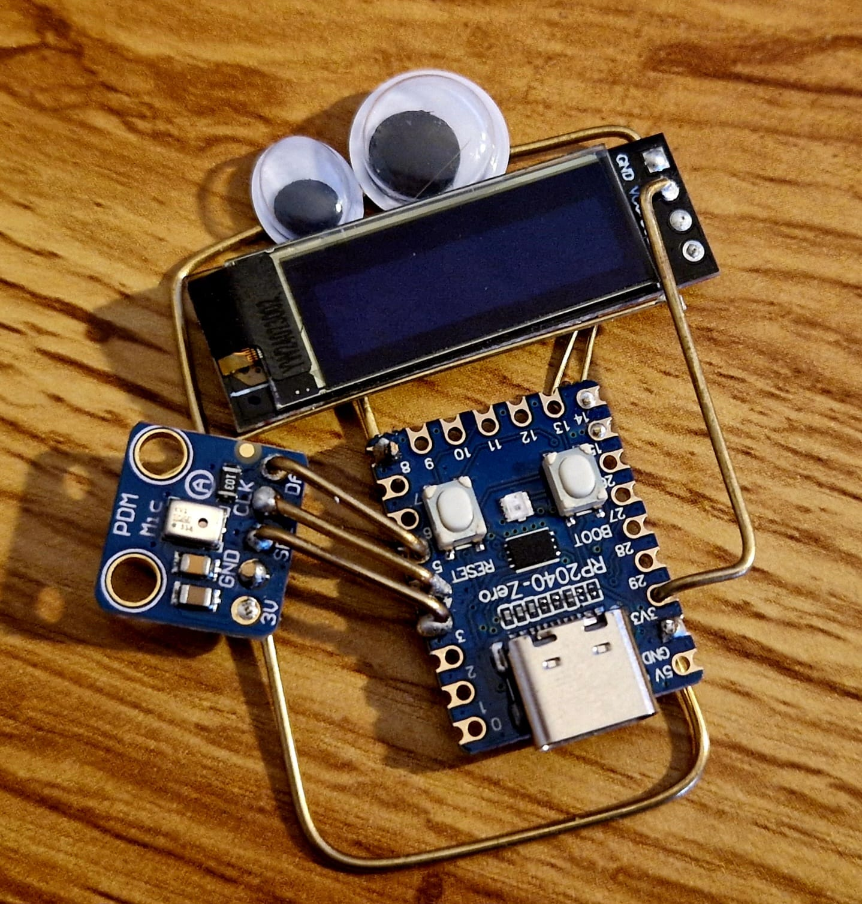
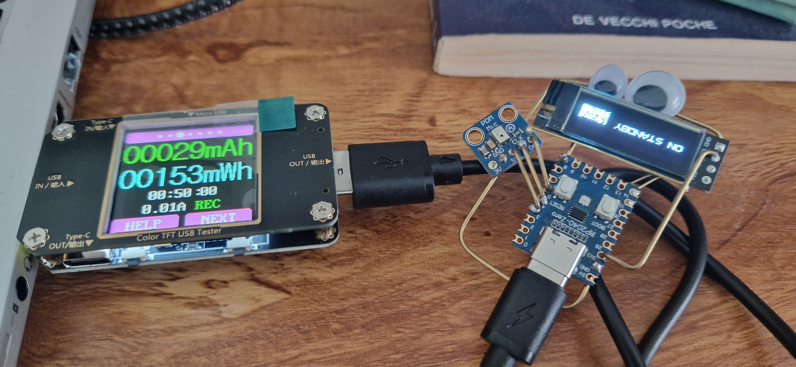

# Random Baseline Model for Climate Disinformation Classification

## Model Description

This is a quantified baseline model for sound classification on a rp2040, for the Frugal AI Challenge 2025.
Why? Because the hardware runs real-time classification using 0.25W =)

Some under the hood peek:

* Refer to the [implementation notebook](notebooks/template-audio.ipynb)
* Refer to the [training notebook](notebooks/v11_FrugalAI.ipynb)

## Hardware description

A rp2040 microcontroler, with a PDM mic, and and OLED screen.



## Check of consumptions

Consumption for realtime consumption
* without inference: 3.060 mWh/min --> 186mW
* with inference: 3.107 mWh/min --> 186.5mW 
* 


### Intended Use

- **Primary intended uses**: Demonstrating that it's possible to do real-time classification, with okay-ish accuracy, on a 2$ microcontroler.
- **Primary intended users**: Researchers and developers participating in the Frugal AI Challenge, with a focus on the EdgeAI cosiderations.
- **Out-of-scope use cases**: Not intended for production use or real-world classification tasks

## Training Data

The model uses the `rfcx/frugalai` dataset:
- Size: ~50k samples of 3s
- Split: 80% train, 20% test
- 2 categories (chainsaw/no chainsaw)

Beware, there are some inconsistencies in the length.

### Labels

0. Chainsaw
1. Environment

## Performance

Refer to the [implementation notebook](notebooks/template-audio.ipynb)

### Metrics
- **Accuracy**: ~87.5% 
- **Environmental Impact**:
  - Emissions tracked in gCO2eq : 0.287645456075
  - Energy consumption tracked in Wh : 0.779243206008

### Result

```json
{
  "username": "kelu124",
  "space_url": "https://huggingface.co/spaces/kelu124/pico-sound",
  "submission_timestamp": "2025-01-30T11:22:21.436878",
  "model_description": "rp2040 inference",
  "accuracy": 0.8713235294117647,
  "energy_consumed_wh": 0.7792432060080811,
  "emissions_gco2eq": 0.28764545607537884,
  "emissions_data": {
    "run_id": "74e7c14a-bcae-4f47-b010-e9c3c576d4f2",
    "duration": 22.433365739000237,
    "emissions": 0.00028764545607537885,
    "emissions_rate": 0.000012822262056714762,
    "cpu_power": 105,
    "gpu_power": 14.30419952643268,
    "ram_power": 5.74672794342041,
    "cpu_energy": 0.0006542979921624957,
    "gpu_energy": 0.00008913562686400055,
    "ram_energy": 0.0000358095869815849,
    "energy_consumed": 0.000779243206008081,
    "country_name": "United States",
    "country_iso_code": "USA",
    "region": "virginia",
    "cloud_provider": "",
    "cloud_region": "",
    "os": "Linux-5.10.230-223.885.amzn2.x86_64-x86_64-with-glibc2.36",
    "python_version": "3.11.11",
    "codecarbon_version": "2.8.3",
    "cpu_count": 4,
    "cpu_model": "Intel(R) Xeon(R) Platinum 8259CL CPU @ 2.50GHz",
    "gpu_count": 1,
    "gpu_model": "1 x Tesla T4",
    "ram_total_size": 15.324607849121094,
    "tracking_mode": "machine",
    "on_cloud": "N",
    "pue": 1
  },
  "api_route": "/audio",
  "dataset_config": {
    "dataset_name": "rfcx/frugalai",
    "test_size": 0.2,
    "test_seed": 42
  }
}
```

### Model Architecture

The ETL:
- A spectrogram transformation (3s sample at 12kHz to a 35x129 image

Model layers include:
- Resize to 32x32 image
- 2D Convolution
- MaxPool2D
- Flatten
- Dropout
- Dense - 2 categories

Based on this work by [ARM people](https://github.com/ArmDeveloperEcosystem/ml-audio-classifier-example-for-pico)

## Environmental Impact

Environmental impact is tracked using CodeCarbon, measuring:
- Carbon emissions during inference
- Energy consumption during inference

This tracking helps establish a baseline for the environmental impact of model deployment and inference.

## Limitations

- Not suitable for any real-world applications

## Ethical Considerations

- Environmental impact is tracked to promote awareness of AI's carbon footprint
```
